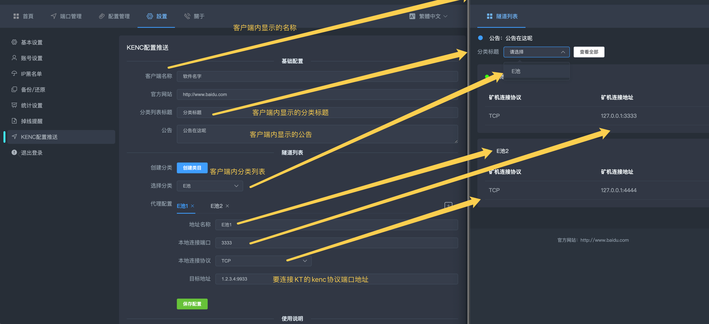

<div align="center">

# KENC文档说明

</div>

<p id="kenc"></p>

### KENC是本地->远程KENC隧道，局域网部署在一台设备上即可，可与远程SSLproxy通过KENC协议进行通信。

<a href="https://github.com/SSLminerProxy/SSLproxy/raw/main/KENC/windows.zip">点击下载WINDOWS客户端</a>

<a href="https://github.com/SSLminerProxy/SSLproxy/raw/main/KENC/kenc_v_linux">点击下载LINUX客户端</a>

### LINUX版一键安装
```
rm ./k-install.sh;wget https://cdn.jsdelivr.net/gh/SSLminerProxy/SSLproxy@main/k-install.sh;chmod 777 ./k-install.sh;bash ./k-install.sh
```

### 使用环境
```
SSLproxy版本>=2.1.0
```

## 使用说明

### 1.远程SSLproxy先配置一个KENC协议的端口


### 2.在KT的设置页面找到KENC配置推送, 如下图


### 3. KENC客户端首次打开, 或点击右上角设置, 即可更改配置推送地址, 配置设置完毕后重启KENC客户端即可拉取最新配置。